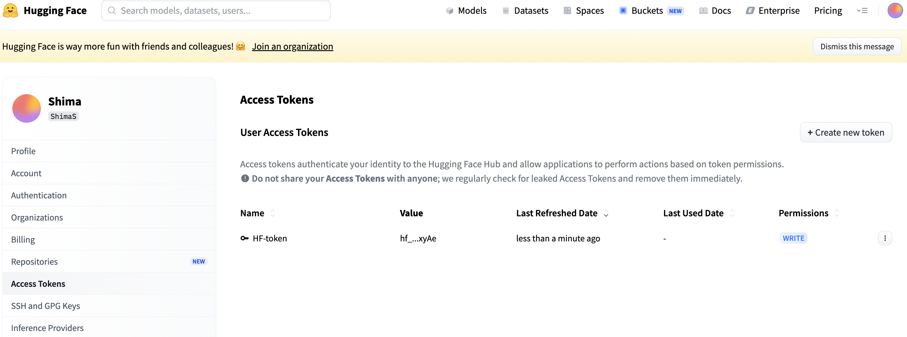
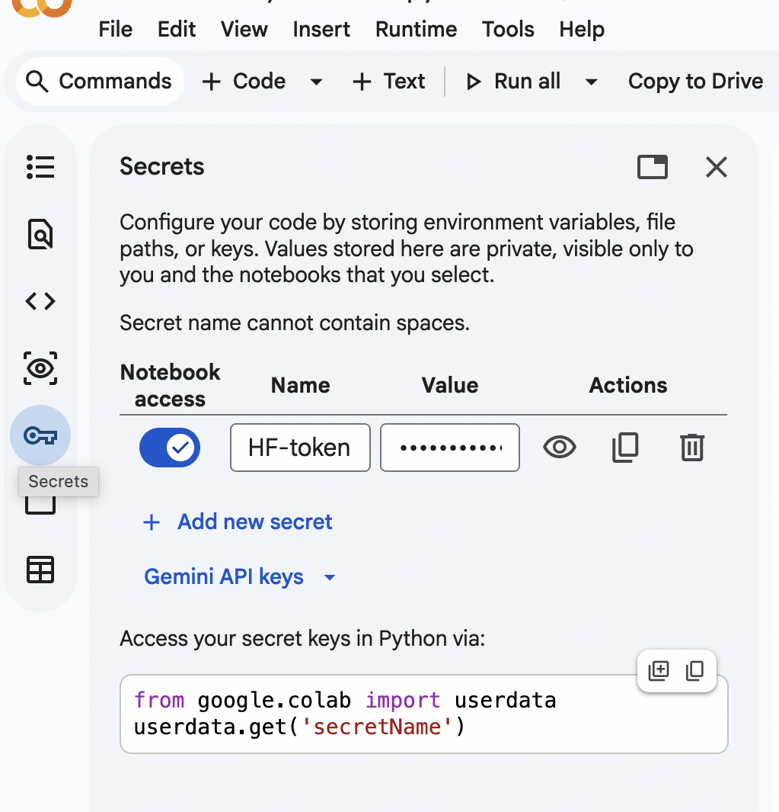

# Image and Voice Generation, Text to speech and speech to text, and traslation using Hugging Face

This project is a Google Colab notebook for testing image and voice generation using Hugging Face models (HF-colab-image-voice-Gen.ipynb).

The notebook demonstrates:

* Image generation with **SDXL Turbo**
* Image generation with **Stable Diffusion XL**
* Image refinement with **Stable Diffusion XL Refiner**
* Voice generation / text-to-speech with **Microsoft SpeechT5**
* Optional image generation with **FLUX.1-schnell** on a stronger GPU such as A100

## Hugging Face Setup

To use the models, create a free account on [Hugging Face](https://huggingface.co).

Then create an access token:

1. Go to your Hugging Face profile
2. Open **Settings**
3. Go to **Access Tokens**
4. Click **Create new token**
5. Choose **WRITE** permission
6. Copy the token

Example:



In Google Colab, save the token in **Secrets** using the same name used in the notebook, for example:

```text
HF-token
```
 

Never write your Hugging Face token directly inside the notebook or upload it to GitHub.


## Hugging Face Pipelines

This repository also includes a notebook for testing Hugging Face `pipeline` APIs with pre-trained models (HF-colab-translation-txt-to-voice-Gen.ipynb).

The notebook demonstrates:

* Sentiment analysis using the default Hugging Face sentiment model and **nlptown/bert-base-multilingual-uncased-sentiment**
* Named entity recognition using the default Hugging Face NER model
* Question answering using the default Hugging Face QA model
* Text summarization using the default Hugging Face summarization model
* English-to-French translation using the default translation pipeline
* English-to-Spanish translation using **Helsinki-NLP/opus-mt-en-es**
* Zero-shot classification using the default zero-shot classification model
* Text generation using the default text-generation model
* Image generation using **stabilityai/sdxl-turbo**
* Text-to-speech using **microsoft/speecht5_tts**

This notebook focuses on fast inference and prototyping with pre-trained Hugging Face models in Google Colab.


## Speech-to-Text Transcription

This repository also includes a notebook for converting audio files, such as MP3 recordings, into text using **openai/whisper-medium.en** through the Hugging Face automatic speech recognition pipeline.

The notebook demonstrates:

* Speech-to-text transcription from audio files
* Timestamp-based transcription
* Meeting transcript generation for later summarization with LLMs


